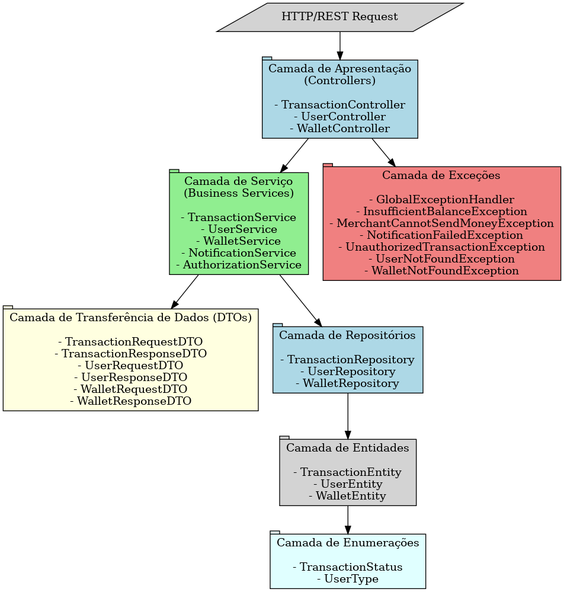
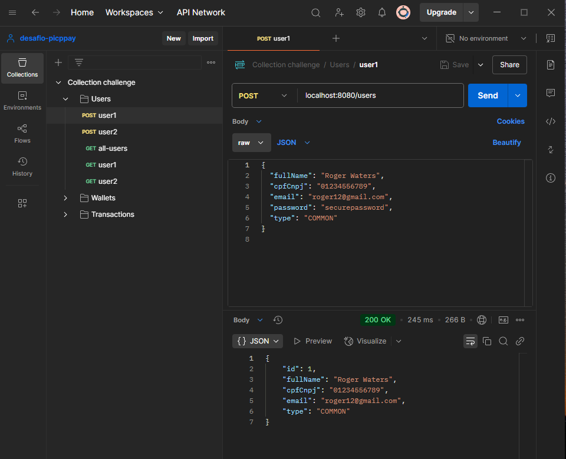
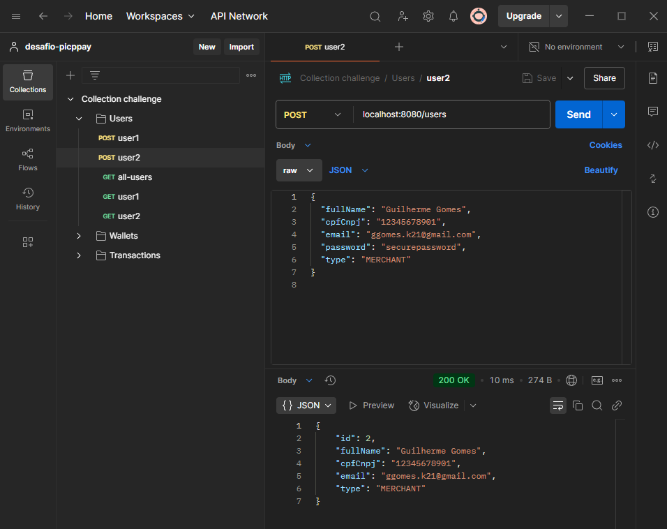
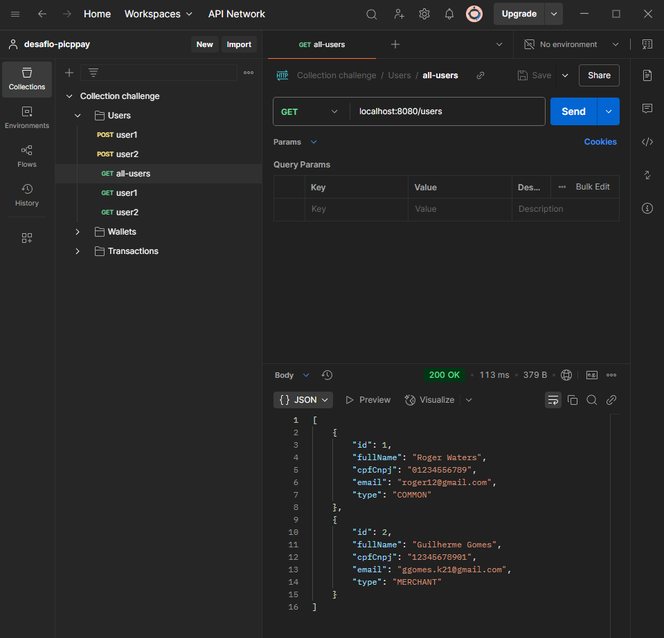
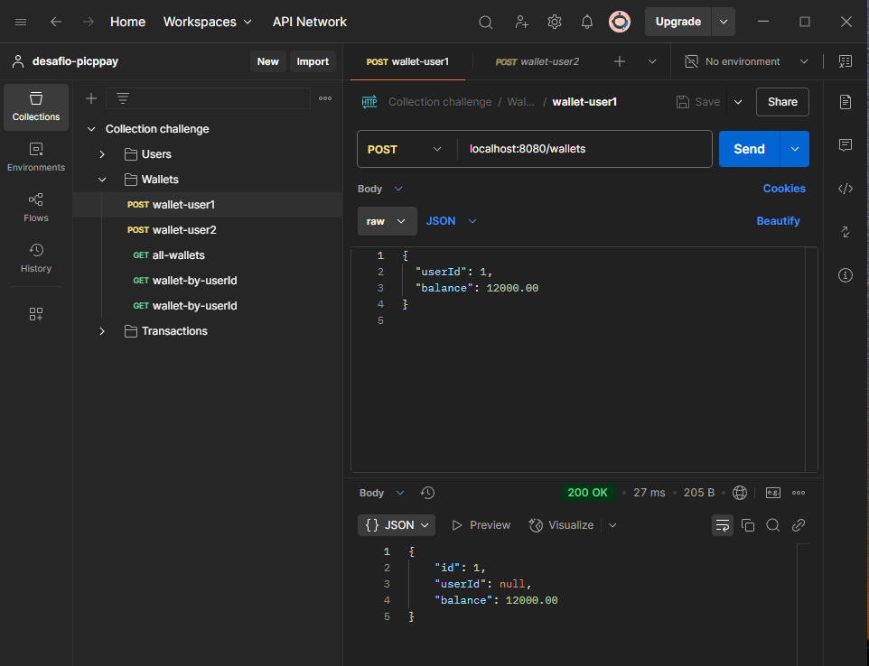
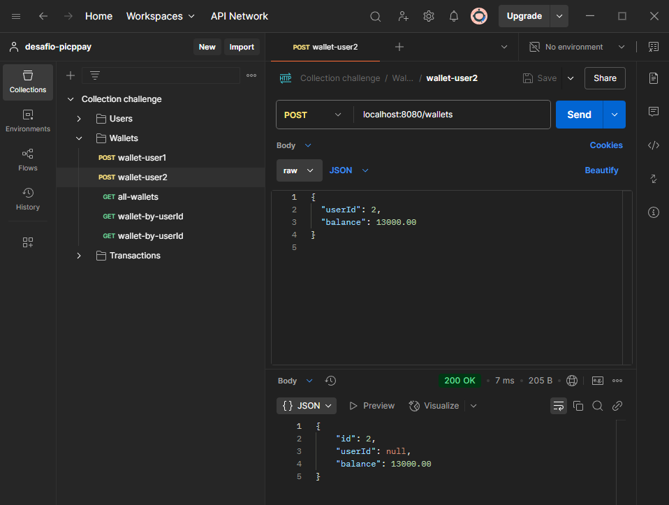
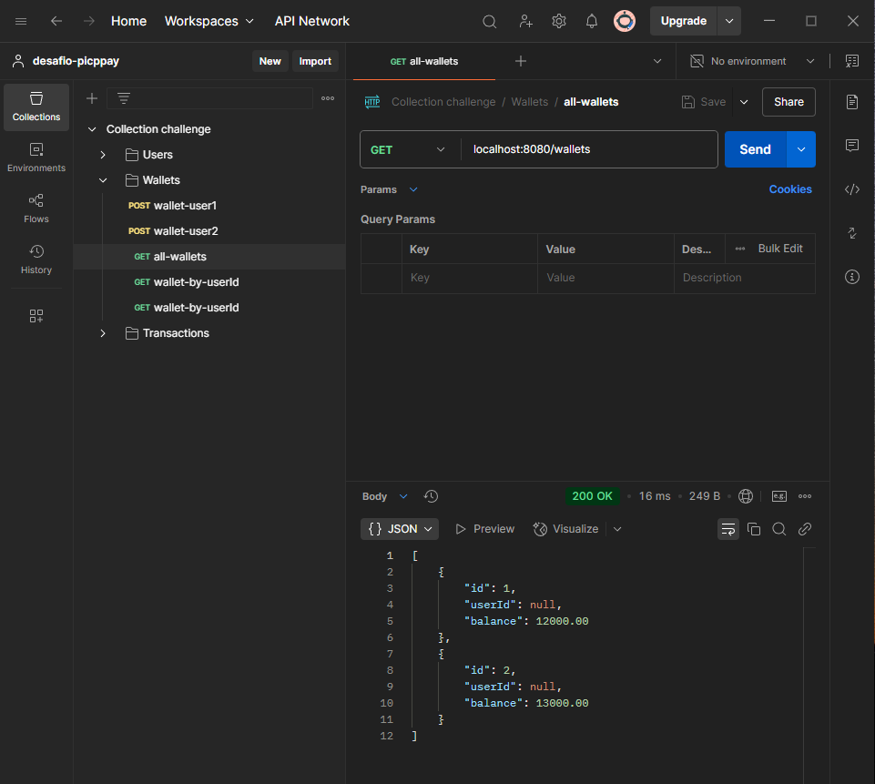
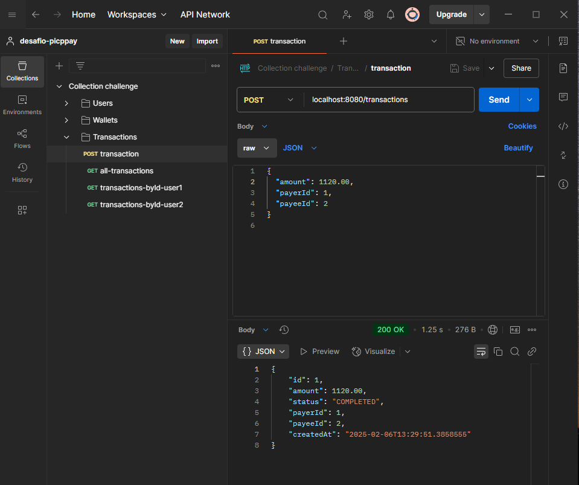
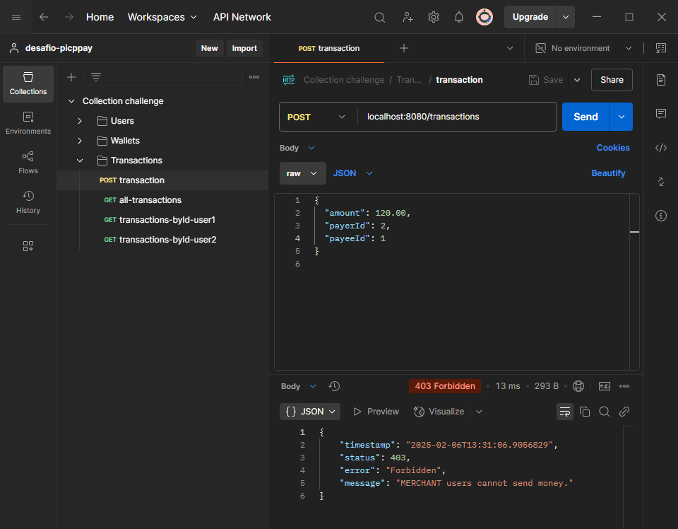
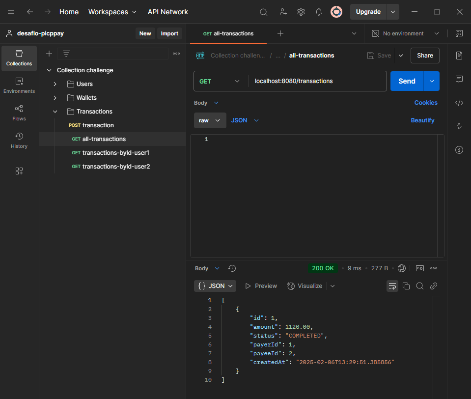

# 💰 PicPay Simplificado - Payment API

Resolution of the Backend-br Challenge.

You can access the GitHub repository for this project here:
[Picpay-challenge](https://github.com/PicPay/picpay-desafio-backend)


This is a simplified **payment platform** that allows users to deposit money and perform **money transfers** between accounts.

---

## 📌 About the Project

This API provides functionalities to handle **two types of users**:  
✅ **Common Users** → Can send and receive money  
✅ **Merchants** → Can **only receive** money  

The platform ensures **security and compliance** by validating transactions, checking balances, and authorizing payments using an external service.

---

## 🎯 Features

- ✅ **User Registration** (with unique CPF/CNPJ and email validation)  
- ✅ **Digital Wallets** (store balance for transactions)  
- ✅ **Transfers between Users & Merchants**  
- ✅ **Transaction Authorization via External API**  
- ✅ **Notification Service on Successful Transactions**  
- ✅ **Rollback Mechanism for Failed Transactions**  
- ✅ **Centralized Exception Handling**  
- ✅ **Swagger API Documentation**  

---

## 📐 Architecture

The project follows a **layered architecture**, ensuring modularity and maintainability.

📂 **Main Layers:**
1. **Controllers** → Handles HTTP requests  
2. **Services** → Business logic implementation  
3. **Repositories** → Database interactions  
4. **DTOs (Data Transfer Objects)** → Standardized data transfer  
5. **Exception Handling** → Unified error management  

### 🏛️ Architecture Diagram  




---

## 🛠️ Technologies Used

- **Java 23**  
- **Spring Boot 3**  
- **Spring Data JPA**  
- **H2 Database (for in-memory testing)**  
- **Lombok**  
- **Swagger (OpenAPI)**  

---

## 📂 Project Structure

📁 **Project Folders:**
```
📦 api-rest-desafio-picpay
 ┣ 📂 src
 ┃ ┣ 📂 main
 ┃ ┃ ┣ 📂 java/com/ggomes/api_rest_desafio_picpay
 ┃ ┃ ┃ ┣ 📂 config
 ┃ ┃ ┃ ┣ 📂 controllers
 ┃ ┃ ┃ ┣ 📂 dtos
 ┃ ┃ ┃ ┣ 📂 services
 ┃ ┃ ┃ ┣ 📂 repositories
 ┃ ┃ ┃ ┣ 📂 entities
 ┃ ┃ ┃ ┃ ┗ 📂 enums
 ┃ ┃ ┃ ┣ 📂 exceptions
 ┃ ┃ ┣ 📂 resources
 ┃ ┃ ┃ ┗ 📂 db / migration
 ┃ ┃ ┃ ┃  ┗ 📜 v1__create_users_table.sql
 ┃ ┃ ┃ ┃  ┗ 📜 v2__create_wallets_table.sql
 ┃ ┃ ┃ ┃  ┗ 📜 v3__create_transactions_table.sql
 ┃ ┃ ┃ ┗ 📜 application.properties
 ┣ 📜 pom.xml
 ┗ 📜 README.md
```
---

## 🚀 Running the Application

### **Prerequisites**
Ensure you have the following installed:

✅ **Java 23**  
✅ **Maven**  
✅ **Lombok**  

### **Build and Run**
To build and start the application, run the following commands:

```sh
mvn clean install
mvn spring-boot:run
```

The application will be available at:

```
http://localhost:8080
```

---

## 🔄 API Endpoints

### 📌 **User Controller (`/users`)**

#### **➕ Create User**
```http
POST /users
```
**Request Body:**
```json
{
  "fullName":  "Guilherme Gomes",
  "cpfCnpj": "12345678901",
  "email": "ggomes.k21@gmail.com",
  "password": "securePassword",
  "type": "COMMON"
}
```
**Responses:**
- `201 Created` - User registered successfully  
- `400 Bad Request` - Invalid input data  
- `409 Conflict` - CPF/CNPJ or Email already exists  

---

### 📌 **Wallet Controller (`/wallets`)**

#### **➕ Create Wallet**
```http
POST /wallets
```
**Request Body:**
```json
{
  "userId": 1,
  "balance": 500.00
}
```
**Responses:**
- `201 Created` - Wallet created  
- `404 Not Found` - User not found  

#### **📌 Get Wallet by User ID**
```http
GET /wallets/{userId}
```
**Response:**
```json
{
  "id": 1,
  "balance": 500.00
}
```
**Responses:**
- `200 OK` - Wallet retrieved  
- `404 Not Found` - Wallet not found  

---

### 📌 **Transaction Controller (`/transactions`)**

#### **➕ Create Transaction**
```http
POST /transactions
```
**Request Body:**
```json
{
  "payerId": 1,
  "payeeId": 2,
  "amount": 100.00
}
```

**Responses:**
- `201 Created` - Transaction completed  
- `400 Bad Request` - Insufficient balance  
- `403 Forbidden` - Unauthorized transaction  
- `500 Internal Server Error` - External service failure  

---

## 📬 API Testing with Postman

🚀 **Testing Endpoints in Postman**  
Below are example test results using **Postman**.

## 📬 API Testing with Postman

🚀 **Testing Endpoints in Postman**  
Below are example test results using **Postman**.

<table>
  <tr>
    <td><strong>Post COMMON users</strong></td>
    <td><strong>Post MERCHANT users</strong></td>
  </tr>
  <tr>
    <td></td>
    <td></td>
  </tr>
  <tr>
    <td><strong>Get all users</strong></td>
    <td><strong>Post wallet user COMMON</strong></td>
  </tr>
  <tr>
    <td></td>
    <td></td>
  </tr>
  <tr>
    <td><strong>Post wallet user MERCHANT</strong></td>
    <td><strong>Get all wallets</strong></td>
  </tr>
  <tr>
    <td></td>
    <td></td>
  </tr>
  <tr>
    <td><strong>Post transactions User COMMON to User MERCHANT</strong></td>
    <td><strong>Post transactions User MERCHANT to User COMMON</strong></td>
  </tr>
  <tr>
    <td></td>
    <td></td>
  </tr>
  <tr>
    <td><strong>Get all transactions</strong></td>
  </tr>
  <tr>
    <td></td>
  </tr>
</table>


---

## 🛡️ Exception Handling

The API has **centralized exception handling** to return consistent error messages.

| Exception                      | HTTP Status | Message Example |
|--------------------------------|-------------|----------------|
| `UserNotFoundException`        | 404 Not Found | "User not found" |
| `InsufficientBalanceException` | 400 Bad Request | "Insufficient funds" |
| `UnauthorizedTransactionException` | 403 Forbidden | "Transaction not authorized" |
| `NotificationFailedException`  | 503 Service Unavailable | "Notification service failed" |

---

## 📑 Swagger API Documentation

The **Swagger UI** is available at:  
🔗 `http://localhost:8080/swagger-ui/index.html`


---

## 🎯 Future Improvements

🚀 **Enhancements for scalability & maintainability:**
- ✅ **Migrate from H2 to PostgreSQL running on docker**
- ✅ **Improve test coverage with JUnit & Mockito**
- ✅ **Implement JWT authentication for security**

---

## 📜 License

This project is **open-source** and available under the [MIT License](LICENSE).
